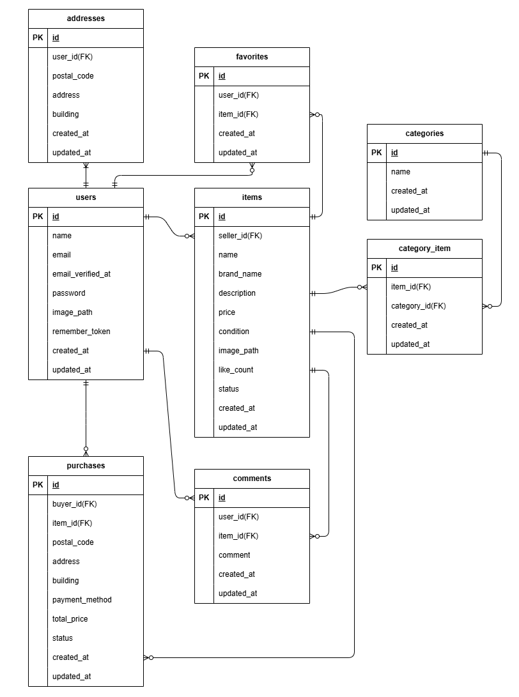

# アプリケーション名
coachtechフリマ（fleama）

## 概要
本アプリケーションは、商品の出品と購入ができるフリマアプリです。

## 機能一覧
- 商品一覧・詳細・検索
- 商品の出品（画像のアップロードあり）
- 購入機能（stripe決済連携）
- 会員登録／ログイン（Fortify）
- メール認証（MailHog）
- 配送先登録・変更（セッション管理）
- いいね機能
- コメント機能

## 使用技術(実行環境)
- php 8.1  
- Laravel  8.83.29  
- MySQL 8.0.26  
- nginx 1.21.1  

## 画面遷移図
こちらの[画面遷移図（Figma）](https://www.figma.com/design/qUScLVuyOfi3XKez6uuw9S/%E6%A8%A1%E6%93%AC%E6%A1%88%E4%BB%B6_%E6%96%B0%E3%83%95%E3%83%AA%E3%83%9E?node-id=0-1&p=f)をご参照ください。

## API・ルーティング一覧
### 公開ルート
| Method | URI | Controller | Summary |
|--------|------|------------|---------|
| GET | / | ItemController@index | 商品一覧 |
| GET | /item/{item_id} | ItemController@show | 商品詳細 |
| GET | /purchase/success | view(purchase.success) | Stripe決済成功 |
| GET | /purchase/cancel | view(purchase.cancel) | Stripe決済キャンセル |

### メール認証（Fortify）
| Method | URI | Middleware | Summary |
|--------|------|------------|---------|
| GET | /email/verify | auth | 認証待ち画面 |
| GET | /email/verify/{id}/{hash} | auth, signed, throttle | メール認証完了処理 |
| POST | /email/verification-notification | auth, throttle | 認証メール再送 |

### 認証 + verified
#### マイページ
| Method | URI | Controller | Summary |
|--------|------|------------|---------|
| GET | /mypage | MypageController@index | マイページ |
| GET | /mypage/profile | MypageController@edit | プロフィール編集 |
| POST | /mypage/profile | MypageController@update | プロフィール更新 |

#### いいね
| Method | URI | Controller |
|--------|------|------------|
| POST | /item/{item_id}/favorite | FavoriteController@store |

#### コメント
| Method | URI | Controller |
|--------|------|------------|
| POST | /item/{item_id}/comments | CommentController@store |

#### 出品
| Method | URI | Controller |
|--------|------|------------|
| GET | /sell | SellController@create |
| POST | /sell | SellController@store |

#### 購入
| Method | URI | Controller | Summary |
|--------|------|------------|---------|
| GET | /purchase/address/{item_id} | PurchaseController@editAddress | 配送先編集 |
| POST | /purchase/address/{item_id} | PurchaseController@updateAddress | 配送先更新 |
| GET | /purchase/{item_id} | PurchaseController@create | 購入確認 |
| POST | /purchase/{item_id} | PurchaseController@store | 購入処理（Stripe） |

## ER図


## テーブル仕様書
[「テーブル仕様書（生徒様入力用）」](https://docs.google.com/spreadsheets/d/1laRrww31hKXqXE2GTgUUb7zHDo1EgEtJsC-zCZ_aFjY/edit?gid=1188247583#gid=1188247583)のテーブル仕様をご参照ください。

## 環境構築
### 1. リポジトリを取得しDockerを起動
```bash
git clone https://github.com/nayu1011/fleama.git
cd fleama
docker compose up -d --build
```

＊MySQLが起動しない場合は、OSによりdocker-compose.ymlの設定を調整してください。

### 2.Laravelセットアップ
/srcディレクトリ内で.env.exampleファイルから.envを作成し、以下の環境変数を変更してください。
```
DB_HOST=mysql
DB_DATABASE=laravel_db
DB_USERNAME=laravel_user
DB_PASSWORD=laravel_pass
```

#### Stripe（Checkout、テストモード）設定：
```
STRIPE_KEY=pk_test_xxxxxxxxxxx
STRIPE_SECRET=sk_test_xxxxxxxxxxx
```

Stripe アカウント（無料）：https://dashboard.stripe.com/register  
「開発者 → APIキー」より取得できます。

### 3.コンテナ内でセットアップ実行
```
docker compose exec php bash
composer install
php artisan key:generate
php artisan migrate --seed
php artisan storage:link
exit
```

### 画像保存場所
- 出品時のアップロード画像：`storage/app/public/images/items/`
- プロフィール画像：`storage/app/public/images/profiles/`

### フロントエンドについて
本アプリでは Laravel Mix / Vite を使用していないため  
`npm install` や `npm run dev` は不要です。

### Stripe
本アプリでは Stripe Checkout（ホスト型決済ページ）を使用しています。  
Laravel の PaymentIntent API は使用していません。

そのため Webhook 設定は不要で、決済後は  
`/purchase/success` または `/purchase/cancel` にリダイレクトされます。

#### テスト決済可能カード
```
カード番号：4242 4242 4242 4242
有効期限：任意（例：12/34）
CVC：任意の3桁（例：123）
```
#### エラーケースをテストするためのカード
```
【決済失敗テスト用（カードが拒否される）】
カード番号：4000 0000 0000 0002

【3Dセキュア認証テスト用（3Dセキュア認証へ遷移）】
カード番号：4000 0027 6000 3184
```
参考：Stripe公式テストカード一覧
https://stripe.com/docs/testing

#### テスト環境での Stripe 挙動
PHPUnit 実行時は Stripe API を呼び出さず、  
内部的に `/purchase/success` にリダイレクトして決済成功扱いとします。  

### メール認証（MailHog）
```
MailHog： http://localhost:8025/
SMTP： 1025
```

## リレーション方針（User–Address）
将来的な拡張（複数住所・履歴保持など）を考慮し、  
User hasMany Address を採用しています。

## バリデーションの特記事項
### 住所カラム（address / building）
DB 型が VARCHAR(255) のため、以下を推奨します。
```
'address'  => ['string', 'max:255'],
'building' => ['nullable', 'string', 'max:255'],
```

### RegisterRequest
メールアドレスの重複を防ぐため、`email.unique`を追加しています。


## URL
開発環境：http://localhost/  
phpMyAdmin：http://localhost:8080/  
MailHog：http://localhost:8025