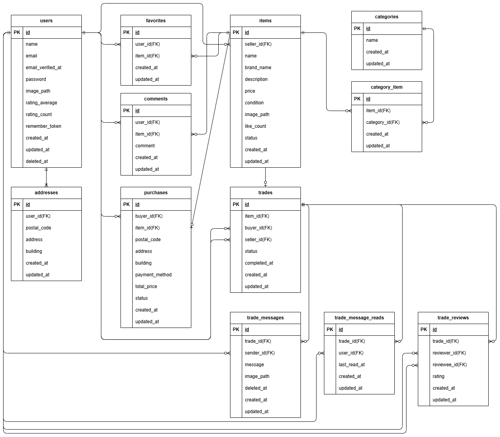

# アプリケーション名
coachtechフリマ（fleama）

## 目次
- [概要](#概要)
- [使用技術(実行環境)](#使用技術実行環境)
- [機能一覧](#機能一覧)
- [環境構築](#環境構築)
- [ダミーデータ](#ダミーデータ)
- [テスト実行](#テスト実行)
- [URL](#url)
- [メール認証](#メール認証mailhog)
- [Stripe](#stripe)
- [API・ルーティング一覧](#apiルーティング一覧)
- [画面遷移図](#画面遷移図)
- [ER図](#er図)
- [テーブル仕様書](#テーブル仕様書)


## 概要
本アプリケーションは、商品の出品と購入ができるフリマアプリです。  
追加機能として、購入後の取引メッセージ送受信、未読メッセージ表示、評価機能を実装しています。

## 使用技術(実行環境)
- php 8.1
- Laravel 8.83.29
- MySQL 8.0.26
- nginx 1.21.1

## 機能一覧
- 商品一覧・詳細・検索
- 商品の出品（画像のアップロードあり）
- 購入機能（Stripe決済連携）
- 会員登録／ログイン（Fortify）
- メール認証（MailHog）
- 配送先登録・変更（セッション管理）
- いいね機能
- コメント機能
- 取引メッセージ送受信機能　★追加
- 未読メッセージ表示機能　★追加
- 評価機能　★追加

## 環境構築
### 1. リポジトリを取得しDockerを起動
```bash
git clone https://github.com/nayu1011/fleama.git
```
```bash
cd fleama
```
```bash
docker compose up -d --build
```

※ MySQLが起動しない場合は、OSにより `docker-compose.yml` の設定を調整してください。

### 2. Laravelセットアップ
`/src` ディレクトリ内で `.env.example` ファイルから `.env` を作成し、以下の環境変数を変更してください。

```env
DB_HOST=mysql
DB_DATABASE=laravel_db
DB_USERNAME=laravel_user
DB_PASSWORD=laravel_pass
```

#### Stripe（Checkout、テストモード）設定
```env
STRIPE_KEY=pk_test_xxxxxxxxxxx
STRIPE_SECRET=sk_test_xxxxxxxxxxx
```

Stripe アカウント（無料）：https://dashboard.stripe.com/register  
アカウントを作成し「開発者 → APIキー」より取得したキーを設定してください。

### 3. コンテナ内でセットアップ実行
```bash
docker compose exec php bash
```
```bash
composer install
```
```bash
php artisan key:generate
```
```bash
php artisan migrate:fresh --seed
```
```bash
php artisan storage:link
```
```bash
php artisan optimize:clear
```
```bash
exit
```

## ダミーデータ
### ユーザーデータ（UsersTableSeeder）
| ID | 名前 | メールアドレス | パスワード | 画像 | 関連データ |
|---|---|---|---|---|---|
| 1 | マイク | seller1@example.com | password | images/profiles/seller1.jpg | 出品あり（5件）、取引あり |
| 2 | シンディ | buyer1@example.com | password | images/profiles/buyer1.jpg | 出品あり（5件）、購入あり、取引あり |
| 3 | 紐づき無しユーザー | buyer2@example.com | password | なし | 商品・取引等の紐づきなし |

### 補足データ（関連Seeder）
- 住所: 3件（各ユーザー1件）
- カテゴリ: 14件
- 商品: 10件（ユーザー1が5件、ユーザー2が5件）
- 購入: 3件（購入者はユーザー2、`item_id:1,2,3`）
- 取引: 3件（すべて進行中、`trade_id:1,2,3`）
- 取引メッセージ: 8件
- 既読管理: 6件（trade × buyer/seller）
- お気に入り: 7件
- コメント: 6件
- 取引レビュー: 0件（動作確認は購入→取引完了→評価送信で確認可能）

## テスト実行
```bash
docker compose exec php bash
```
```bash
php artisan optimize:clear
```
```bash
php artisan test
```
```bash
exit
```

## URL
開発環境：http://localhost/  
phpMyAdmin：http://localhost:8080/  
MailHog：http://localhost:8025

## メール認証（MailHog）
```
MailHog: http://localhost:8025/
SMTP: 1025
```

## Stripe
本アプリでは Stripe Checkout（ホスト型決済ページ）を使用しています。  
Laravel の PaymentIntent API は使用していません。

そのため Webhook 設定は不要で、決済後は  
`/purchase/success` または `/purchase/cancel` にリダイレクトされます。

### テスト決済可能カード
```txt
カード番号: 4242 4242 4242 4242
有効期限: 任意（例: 12/34）
CVC: 任意の3桁（例: 123）
```

### エラーケースをテストするためのカード
```txt
【決済失敗テスト用（カードが拒否される）】
カード番号: 4000 0000 0000 0002

【3Dセキュア認証テスト用（3Dセキュア認証へ遷移）】
カード番号: 4000 0027 6000 3184
```

参考：Stripe公式テストカード一覧  
https://stripe.com/docs/testing

### テスト環境での Stripe 挙動
PHPUnit 実行時は Stripe API を呼び出さず、  
内部的に `/purchase/success` にリダイレクトして決済成功扱いとします。

## 画像保存場所
- 出品時のアップロード画像: `storage/app/public/images/items/`
- プロフィール画像: `storage/app/public/images/profiles/`

## フロントエンドについて
本アプリでは Laravel Mix / Vite を使用していないため  
`npm install` や `npm run dev` は不要です。

## API・ルーティング一覧
### 公開ルート
| Method | URI | Controller | Summary |
|--------|------|------------|---------|
| GET | / | ItemController@index | 商品一覧 |
| GET | /item/{item_id} | ItemController@show | 商品詳細 |
| GET | /purchase/success | PurchaseController@success | Stripe決済成功 |
| GET | /purchase/cancel | PurchaseController@cancel | Stripe決済キャンセル |

### メール認証（Fortify）
| Method | URI | Middleware | Summary |
|--------|------|------------|---------|
| GET | /email/verify | auth | 認証待ち画面 |
| GET | /email/verify/{id}/{hash} | auth, signed, throttle:6,1 | メール認証完了処理 |
| POST | /email/verification-notification | auth, throttle:6,1 | 認証メール再送 |

### 認証 + verified
#### マイページ
| Method | URI | Controller | Summary |
|--------|------|------------|---------|
| GET | /mypage | MypageController@index | マイページ |
| GET | /mypage/profile | MypageController@edit | プロフィール編集 |
| POST | /mypage/profile | MypageController@update | プロフィール更新 |

#### いいね
| Method | URI | Controller | Summary |
|--------|------|------------|---------|
| POST | /item/{item_id}/favorite | FavoriteController@store | いいね登録/解除 |

#### コメント
| Method | URI | Controller | Summary |
|--------|------|------------|---------|
| POST | /item/{item_id}/comments | CommentController@store | コメント投稿 |

#### 出品
| Method | URI | Controller | Summary |
|--------|------|------------|---------|
| GET | /sell | SellController@create | 出品画面表示 |
| POST | /sell | SellController@store | 出品登録 |

#### 購入
| Method | URI | Controller | Summary |
|--------|------|------------|---------|
| GET | /purchase/address/{item_id} | PurchaseController@editAddress | 配送先編集画面 |
| POST | /purchase/address/{item_id} | PurchaseController@updateAddress | 配送先更新 |
| GET | /purchase/{item_id} | PurchaseController@create | 購入確認画面 |
| POST | /purchase/{item_id} | PurchaseController@store | 購入処理（Stripe） |

#### 取引
| Method | URI | Controller | Summary |
|--------|------|------------|---------|
| GET | /trade/{trade} | TradeController@show | 取引詳細画面 |
| POST | /trade/{trade}/message | TradeController@store | 取引メッセージ送信 |
| PATCH | /trade/messages/{message} | TradeController@update | 取引メッセージ編集 |
| DELETE | /trade/messages/{message} | TradeController@destroy | 取引メッセージ削除 |
| POST | /trade/{trade}/review | TradeController@review | 取引評価送信 |

## 画面遷移図
こちらの[画面遷移図（Figma）](https://www.figma.com/design/qUScLVuyOfi3XKez6uuw9S/%E6%A8%A1%E6%93%AC%E6%A1%88%E4%BB%B6_%E6%96%B0%E3%83%95%E3%83%AA%E3%83%9E?node-id=0-1&p=f)をご参照ください。<br>
追加機能分は[画面遷移図（Figma）](https://www.figma.com/design/73p1YzUjZX254iYWutLQrD/Pro%E5%85%A5%E4%BC%9A%E3%83%86%E3%82%B9%E3%83%88_%E3%83%95%E3%83%AA%E3%83%9E%E3%82%A2%E3%83%97%E3%83%AA?node-id=0-1&p=f&t=KRlJWfvWMbXWKL5c-0)をご参照ください。

## ER図


## テーブル仕様書
[「テーブル仕様書（生徒様入力用）」](https://docs.google.com/spreadsheets/d/1laRrww31hKXqXE2GTgUUb7zHDo1EgEtJsC-zCZ_aFjY/edit?gid=1188247583#gid=1188247583)のテーブル仕様をご参照ください。

## リレーション方針（User–Address）
将来的な拡張（複数住所・履歴保持など）を考慮し、  
User hasMany Address を採用しています。

## バリデーションの特記事項
### 住所カラム（address / building）
DB 型が VARCHAR(255) のため、以下を推奨します。

```php
'address' => ['string', 'max:255'],
'building' => ['nullable', 'string', 'max:255'],
```

### RegisterRequest
メールアドレスの重複を防ぐため、`email.unique` を追加しています。
